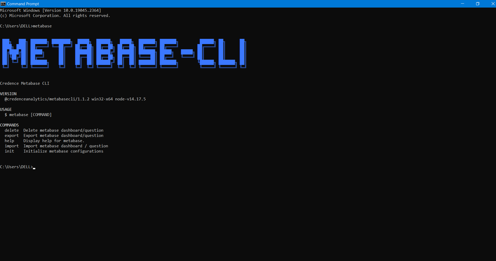

# METABASE CLI

Command Line Interface for export/import of dashboard/question  of one [Metabase](https://www.metabase.com/) server to another.
The tools uses standard [Metabase API](https://www.metabase.com/docs/latest/api-documentation) to export the data 

# Prerequisites

1. Node.js ([Download Link](https://nodejs.org/en/download/))
    > Tried and tested on version 12.18.2

# Installations

-   clone this git repository
-   go to the metabase directory

```
cd metabase
```

-   run `npm link --force `

-   once done run metabase from any directory and you should get an output like below :



<!-- ## Initialize Metabase Configurations

     $ metabase init

usagestop -->

# Commands

<!-- commands -->

> PREREQUISITE : You should have `Metabase` up and running either in your local machine or in remote server.

## `metabase init`

To Initialize metabase configurations

```zsh
  $ metabase init
```


## `metabase export`

To export a question or dashboard from metabase

```zsh
  $ metabase export
```

-   Dashboard
    -   Show list of dashboards
    -   Select one dashboard
-   Question
    -   Show list of questions
    -   Select one question


## `metabase import`

To import a question or dashboard in metabase

> PREREQUISITE : You should have exported file of question or dashboard in `json` format.

> Make sure that the file you are importing has following properties in it.

-   type property and it's value should be either Q or D.
-   data.

```zsh
  $ metabase import
```

-   Provide a valid path to the file you want to import, it must be in `json` format.
-   Database Show list of connected databases to the metabase. Select appropriate database


## `metabase delete`

To delete a question or dashboard from metabase

-   Dashboard
    -   Show list of dashboards
    -   Select one dashboard
-   Question
    -   Show list of questions
    -   Select one question

```zsh
  $ metabase delete
```


## `metabase plugins`

List installed plugins.

```
USAGE
  $ metabase plugins [--core]

FLAGS
  --core  Show core plugins.

DESCRIPTION
  List installed plugins.

EXAMPLES
  $ metabase plugins
```

_See code: [@oclif/plugin-plugins](https://github.com/oclif/plugin-plugins/blob/v2.1.1/src/commands/plugins/index.ts)_

## `metabase plugins:install PLUGIN...`

Installs a plugin into the CLI.

```
USAGE
  $ metabase plugins:install PLUGIN...

ARGUMENTS
  PLUGIN  Plugin to install.

FLAGS
  -f, --force    Run yarn install with force flag.
  -h, --help     Show CLI help.
  -v, --verbose

DESCRIPTION
  Installs a plugin into the CLI.

  Can be installed from npm or a git url.

  Installation of a user-installed plugin will override a core plugin.

  e.g. If you have a core plugin that has a 'hello' command, installing a user-installed plugin with a 'hello' command
  will override the core plugin implementation. This is useful if a user needs to update core plugin functionality in
  the CLI without the need to patch and update the whole CLI.

ALIASES
  $ metabase plugins add

EXAMPLES
  $ metabase plugins:install myplugin

  $ metabase plugins:install https://github.com/someuser/someplugin

  $ metabase plugins:install someuser/someplugin
```

## `metabase plugins:inspect PLUGIN...`

Displays installation properties of a plugin.

```
USAGE
  $ metabase plugins:inspect PLUGIN...

ARGUMENTS
  PLUGIN  [default: .] Plugin to inspect.

FLAGS
  -h, --help     Show CLI help.
  -v, --verbose

DESCRIPTION
  Displays installation properties of a plugin.

EXAMPLES
  $ metabase plugins:inspect myplugin
```

## `metabase plugins:install PLUGIN...`

Installs a plugin into the CLI.

```
USAGE
  $ metabase plugins:install PLUGIN...

ARGUMENTS
  PLUGIN  Plugin to install.

FLAGS
  -f, --force    Run yarn install with force flag.
  -h, --help     Show CLI help.
  -v, --verbose

DESCRIPTION
  Installs a plugin into the CLI.

  Can be installed from npm or a git url.

  Installation of a user-installed plugin will override a core plugin.

  e.g. If you have a core plugin that has a 'hello' command, installing a user-installed plugin with a 'hello' command
  will override the core plugin implementation. This is useful if a user needs to update core plugin functionality in
  the CLI without the need to patch and update the whole CLI.

ALIASES
  $ metabase plugins add

EXAMPLES
  $ metabase plugins:install myplugin

  $ metabase plugins:install https://github.com/someuser/someplugin

  $ metabase plugins:install someuser/someplugin
```

## `metabase plugins:link PLUGIN`

Links a plugin into the CLI for development.

```
USAGE
  $ metabase plugins:link PLUGIN

ARGUMENTS
  PATH  [default: .] path to plugin

FLAGS
  -h, --help     Show CLI help.
  -v, --verbose

DESCRIPTION
  Links a plugin into the CLI for development.

  Installation of a linked plugin will override a user-installed or core plugin.

  e.g. If you have a user-installed or core plugin that has a 'hello' command, installing a linked plugin with a 'hello'
  command will override the user-installed or core plugin implementation. This is useful for development work.

EXAMPLES
  $ metabase plugins:link myplugin
```

## `metabase plugins:uninstall PLUGIN...`

Removes a plugin from the CLI.

```
USAGE
  $ metabase plugins:uninstall PLUGIN...

ARGUMENTS
  PLUGIN  plugin to uninstall

FLAGS
  -h, --help     Show CLI help.
  -v, --verbose

DESCRIPTION
  Removes a plugin from the CLI.

ALIASES
  $ metabase plugins unlink
  $ metabase plugins remove
```

## `metabase plugins:uninstall PLUGIN...`

Removes a plugin from the CLI.

```
USAGE
  $ metabase plugins:uninstall PLUGIN...

ARGUMENTS
  PLUGIN  plugin to uninstall

FLAGS
  -h, --help     Show CLI help.
  -v, --verbose

DESCRIPTION
  Removes a plugin from the CLI.

ALIASES
  $ metabase plugins unlink
  $ metabase plugins remove
```

## `metabase plugins:uninstall PLUGIN...`

Removes a plugin from the CLI.

```
USAGE
  $ metabase plugins:uninstall PLUGIN...

ARGUMENTS
  PLUGIN  plugin to uninstall

FLAGS
  -h, --help     Show CLI help.
  -v, --verbose

DESCRIPTION
  Removes a plugin from the CLI.

ALIASES
  $ metabase plugins unlink
  $ metabase plugins remove
```

## `metabase plugins update`

Update installed plugins.

```
USAGE
  $ metabase plugins update [-h] [-v]

FLAGS
  -h, --help     Show CLI help.
  -v, --verbose

DESCRIPTION
  Update installed plugins.
```

<!-- commandsstop -->
